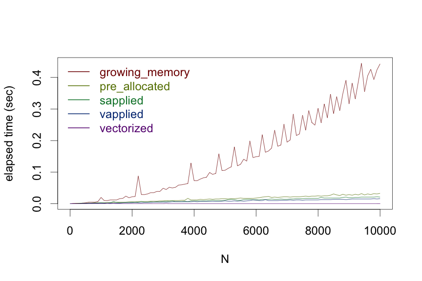
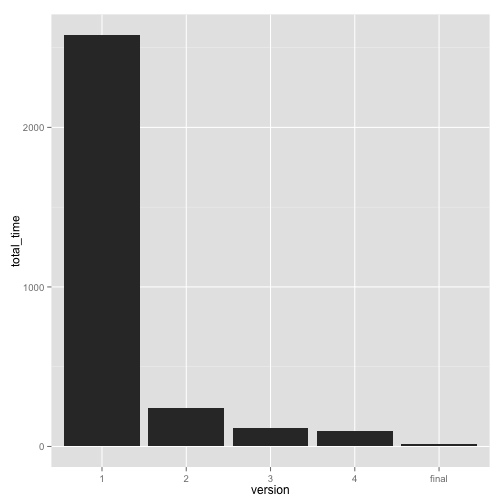

Idiomatic Optimization:  simpler, faster R code 
========================================================
author: Robert Horton, PhD
date: December 1, 2014


Intended Audience
========================================================
This presentation assumes that you: 
* have some experience with R programming
* know how to decompose problems and write functions
* are familiar with the fundamental R data structures
* can write code that gives correct answers, even if it is slow
* want to make your code simpler and faster

Characteristics of R
========================================================
* Scripting language
    - many internals are written in C/C++ or Fortran
* Built-in data structures
    - vectors, matrixes, lists, data frames, environments
    - every variable is at least a vector
        + the columns of a data frame are vectors
        + a matrix is a 2D vector
* Functional
    - functions can take other functions as parameters
    - minimize side-effects and mutable data
    
Idioms in R
========================================================
* Process data by batch, not by item
    - Be declarative rather than imperative
    - Use vector (or matrix) operations if possible
    - Use functional approaches when appropriate
    - Avoid growing data structures in memory
* Use available functions
* Use appropriate data structures

_Idiomatic R should be concise, readable, and fast._

Idiomatic Optimization
========================================================

Idiomatic R should be clear and concise because it is declarative and high-level.

Improvements in speed are a (sometimes dramatic) side benefit.


Iteration: loops, maps, and vectors
========================================================


```
dynamic_alloc  <-  function (N){
    y <- double()
    for (i in 1:N) y[i] <- i^2
    y
} 

pre_allocated  <-  function (N){
    y <- double(N)
    for (i in 1:N) y[i] <- i^2
    y
} 

vapplied  <-  function (N){
    vapply(1:N, function(x) x^2, 0.1)
} 

vectorized  <-  function (N)(1:N)^2 

```

Performance
========================================================

 

Performance
========================================================
 

Case Study
========================================================


***
* Book organized as a series of case studies presenting increasingly complex machine learning approaches
* Programming perspective, rather than straight math
* Well-known authors, respected publisher, fairly popular book
* Examples are all in R
* Code is not idiomatic

Code Breaking as an Optimization Problem
========================================================
* Toy problem: use Metropolis algorithm to solve a substitution cipher
    - A (secret) permutation of the alphabet has been used to encipher a message
    - Try to find the best permutation to reverse the cipher
* Uses a large dictionary of English words and their observed probability of occurrence in training text
    - look for recognizable words in output
    - score message by product of word probabilities
* Requires many iterations of testing and modification

Algorithm
========================================================
* start with a random key, then
    - propose a small modification to the key
        + compare modified key to previous one
        + if modified version is better, use it
        + otherwise, randomly select old or new key, with probability proportional to score
    - repeat modify/test/select cycle many, many times
* not completely greedy
    - sometimes takes slightly lower scoring permutation to avoid getting trapped in local minimum

Profiling run #1
========================================================
(50 iterations in 1.78 sec)
```
                    self.time self.pct
"one.gram.probability"   1.56    91.76
"paste"                  0.04     2.35
"rbind"                  0.02     1.18
"as.data.frame.character"0.02     1.18
"factor"                 0.02     1.18
"make.names"             0.02     1.18
"unlist"                 0.02     1.18

```

one.gram.probability
========================================================
```
one.gram.probability <- function(one.gram, lexical.database = list())
{
  lexical.probability <- lexical.database[[one.gram]]
...
```

`lexical.database` is a list where the keys are English words and the values are the relative frequencies of the word in a training text.

Solution #1: environment vs. list
========================================================

Looking up values by key requires sequential search in a list, and is very slow for long lists. An environment uses hashing to find values by key in constant time, regardless of the number of keys.

```
LEXMAP <- new.env(size=length(lexical.database))
for (i in seq_along(lexical.database))
    LEXMAP[[ names(lexical.database)[i] ]] <- lexical.database[[i]]
```

When copying the dictionary, using an integer index into the original list with double bracket operator was dramatically faster than looking up each word by name.

Profiling run #2
========================================================
(5000 iterations in 24.26 sec)
```
                    self.time self.pct
"rbind"                  3.94    16.32
"paste"                  2.94    12.18
"match"                  2.48    10.27
"[<-.factor"             1.66     6.88
"as.vector"              1.28     5.30
"apply.cipher.to.string" 0.68     2.82
"deparse"                0.54     2.24
"levels"                 0.54     2.24

```

Problem #2: growing results a row at a time
========================================================
```
results <- data.frame()

for (iteration in 1:number.of.iterations){
  ...
  results <- rbind(results,data.frame...
```
  
Solution #2: `do.call` with `rbind`
========================================================

```
results <- do.call("rbind", 
    lapply(1:number.of.iterations, 
        function(i){...
```

Each iteration produces a one-row data frame, and we need to bind them all together. The `rbind` function takes a series of arguments and combines them by rows. We can do the iterations using `lapply` so that the single-row data frames are in a list, then use `do.call` to run `rbind` with all the rows at once.

Profiling run #3
========================================================
(5000 iterations, 11.44 sec)
```
                     self.time self.pct
"paste"                   3.50    30.59
"substr"                  0.80     6.99
"rbind"                   0.66     5.77
"apply.cipher.to.string"  0.60     5.24
"data.frame"              0.48     4.20
"deparse"                 0.44     3.85
"make.names"              0.44     3.85
"as.data.frame"           0.36     3.15
```

Problem #3: string operations
========================================================
```
apply.cipher.to.string <- function(string, cipher)
{
  output <- ''

  for (i in 1:nchar(string))
  {
    output <- paste(output, 
        cipher[[substr(string, i, i)]], 
        sep = '')
  }
  
  return(output)
}
```

Solution #3: vapply cipher
========================================================
```
apply.cipher.to.text <- function(text,
                                cipher){
    decipher_vec <- function(ch_vec, cipher)
        paste(cipher[ch_vec], collapse='')
	vapply(strsplit(text,''),
        decipher_vec, "foo", cipher)
}
```

Profiling run #4
========================================================
(5000 iterations in 9.42 sec)
```
                     self.time self.pct
"rbind"                   0.96    10.19
"paste"                   0.86     9.13
"vapply"                  0.62     6.58
"FUN"                     0.60     6.37
"strsplit"                0.52     5.52
"deparse"                 0.44     4.67
"log.probability.of.text" 0.34     3.61

```

Final Version: multiple changes
========================================================
```
generate.random.cipher <- function()
        paste(sample(letters), collapse='')

alphabet <- paste(letters, collapse='')
encipher <- function(string, cipher)
            chartr(alphabet, cipher, string)
```

Final Profiling Run
========================================================
(50000 iterations in 11.6 sec)
```
                 self.time self.pct
"chartr"              3.38    29.14
"sample.int"          1.38    11.90
"mget"                1.26    10.86
"unlist"              1.06     9.14
".External"           0.80     6.90
"c"                   0.70     6.03
"paste0"              0.66     5.69
"break_cipher"        0.38     3.28
"paste"               0.34     2.93
"sample"              0.30     2.59
```

Time Comparisons
========================================================

 
***
Total time for 50000 iterations was reduced from 
47.1 minutes to 
11.6 seconds
(a 243-fold improvement).


Other Optimization Approaches
========================================================

* byte-code compiling
* memoization
* parallelization
* native code

Idioms in R
========================================================
* Process data by batch, not by item
    - Be declarative rather than imperative
    - Use vector (or matrix) operations if possible
    - Use functional approaches when appropriate
        + *map*: `*apply` family of functions
        + *filter*: subsetting operators, `grep`
        + *reduce*: `sum`, `do.call`, etc.
    - Avoid growing data structures in memory
* Use available functions
* Use appropriate data structures

Session Info
========================================================

```
R version 3.1.1 (2014-07-10)
Platform: x86_64-apple-darwin10.8.0 (64-bit)

locale:
[1] en_US.UTF-8/en_US.UTF-8/en_US.UTF-8/C/en_US.UTF-8/en_US.UTF-8

attached base packages:
[1] stats     graphics  grDevices utils     datasets  methods   base     

other attached packages:
[1] ggplot2_1.0.0 knitr_1.6    

loaded via a namespace (and not attached):
 [1] colorspace_1.2-4 digest_0.6.4     evaluate_0.5.5   formatR_1.0     
 [5] grid_3.1.1       gtable_0.1.2     labeling_0.3     MASS_7.3-34     
 [9] munsell_0.4.2    plyr_1.8.1       proto_0.3-10     Rcpp_0.11.2     
[13] reshape2_1.4     scales_0.2.4     stringr_0.6.2    tools_3.1.1     
```
